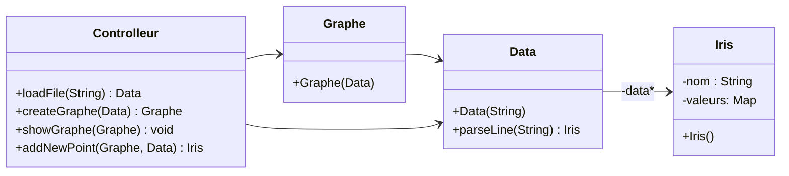

# SAE3.02 Dev. Application-Classification

### Équipe-J2: *SERE Benjamin, BEDU Louis, CROISIER Thibault, SCAVONE Enzo*

---

### Démarrer l'application

Pour démarrer l'application, vous devez avoir **Maven** installé sur votre machine. Si ce n’est pas déjà fait, vous pouvez l’installer en suivant les instructions sur le site officiel : [Installer Maven](https://maven.apache.org/download.cgi).

Une fois Maven installé, ouvrez le terminal, accédez au répertoire du projet **J2_SAE3.3** et exécutez la commande suivante pour démarrer l'application :

```bash
mvn javafx:run
```

L'application se lancera et vous pourrez interagir avec l'interface graphique.

__ATTENTION__ Le fichier chargé doit avoir "pokemon" ou "iris" dans son nom pour que le programme fonctionne (ex : pokemon.csv)

---

## Présentation du projet

Le projet a pour objectif de développer un outil permettant de **charger**, **afficher** et **classifier des données** en utilisant l’algorithme **k-NN** (k plus proches voisins). Ce projet offre une interface graphique permettant de visualiser des jeux de données sous forme de **nuages de points**.

### Fonctionnalités principales :

- **Chargement et affichage des données** : L'utilisateur peut charger des fichiers de données et les visualiser sous forme de nuage de points. Le projet supporte des jeux de données comme Iris.

- **Projection des données** : L'application permet à l'utilisateur de choisir les attributs à projeter sur les axes X et Y pour une exploration interactive des données.

- **Classification k-NN** : L'outil permet de classifier des données non étiquetées en utilisant l'algorithme k-NN, avec la possibilité de choisir différentes distances pour la classification (par exemple, Manhattan ou Euclidienne).

- **Ajout de nouveaux points** : Les utilisateurs peuvent ajouter de nouvelles données au nuage de points et choisir la catégorie de ces nouveaux points, qui seront ensuite intégrés à la visualisation.

- **Évaluation de la robustesse** : L’application permet également d’évaluer la performance du modèle k-NN pour différents paramètres, notamment pour déterminer le meilleur choix de k.

---

## Jalon-1

### Objectifs réalisés :

- **Visualisation du nuage de points Iris** : L'utilisateur peut choisir les axes de projection pour explorer de manière interactive les données du jeu de données Iris.  
  **Status** : ✅ Checké

- **Catégories visibles** : Les points sont affichés avec des couleurs et des formes personnalisables en fonction des catégories des données.  
  **Status** : ✅ Checké

- **Ajout de nouveaux points** : Les utilisateurs peuvent ajouter un point avec une catégorie inconnue, et après l'avoir catégorisé, le point est ajouté au nuage de manière visible.  
  **Status** : ✅ Checké

- **Interface utilisateur intuitive** : L'interface utilisateur est conçue pour être simple et intuitive, permettant une interaction fluide avec les fonctionnalités de projection et d'ajout de points.  
  **Status** : ✅ Checké

Voici la mise à jour des **objectifs réalisés** pour le **Jalon 2** dans votre fichier **README.md** :

---

## Jalon-2

### Objectifs réalisés :

- **Implémentation de l'algorithme k-NN :** L'algorithme k-NN a été implémenté avec succès, permettant de classifier des points en fonction de leurs voisins les plus proches. Les distances peuvent être calculées selon différentes métriques, telles que la distance Euclidienne ou Manhattan.  
  **Status** : ✅ Checké

- **Normalisation des données :** Une méthode de normalisation des données a été ajoutée afin de garantir que les distances entre les points soient calculées de manière juste, en prenant en compte les différentes échelles des attributs.  
  **Status** : ✅ Checké

- **Validation croisée :** Une validation croisée a été mise en place pour évaluer la performance de l'algorithme k-NN. Les résultats de cette validation fournissent des informations sur la robustesse du modèle, comme la précision et le taux d'erreur.  
  **Status** : ✅ Checké

- **Choix optimal du paramètre k :** Des expérimentations ont été réalisées pour tester différentes valeurs de k et déterminer celle qui offre la meilleure performance pour les jeux de données Iris et Pokémon.  
  **Status** : ✅ Checké

- **Évaluation de la robustesse sur différents jeux de données :** La robustesse de l'algorithme a été évaluée sur plusieurs jeux de données, y compris **Iris** et **Pokémon**, avec des classifications effectuées selon différentes catégories (par exemple, par type ou par niveau d'évolution).  
  **Status** : ✅ Checké


---


## Diagramme de classes

Voici un diagramme UML des classes de l'application :



### Explication du diagramme de classes :

- **Iris** : Représente les données du jeu de données Iris. Cette classe contient des informations sur les différentes caractéristiques des fleurs d'Iris (longueur et largeur des pétales, etc.).

- **Data** : Représente un jeu de données. Cette classe permet de charger un fichier, de le parser et de convertir chaque ligne en une instance de la classe **Iris**.

- **Graphe** : Cette classe est responsable de la création du nuage de points en fonction des données fournies. Elle interagit avec la classe **Data** pour générer les visualisations.

- **Controlleur** : Cette classe contrôle l'interaction entre l'utilisateur et l'application. Elle permet de charger un fichier de données, de créer un graphe et d'ajouter de nouveaux points au graphe.

