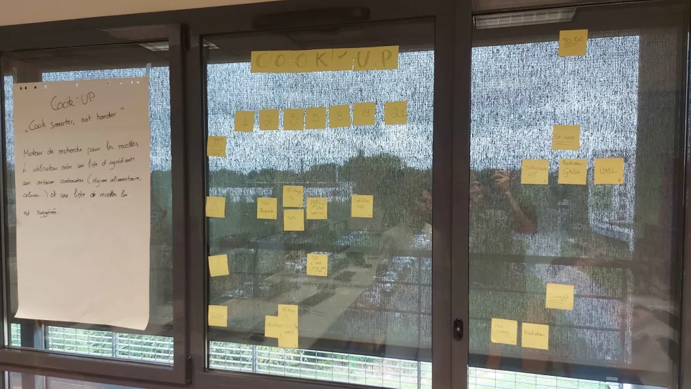

# Sprint 00

## Démo + Planification du sprint suivant

### Ce que nous avons fait durant ce sprint

Lors de ce sprint nous avons décidé du projet, choisi un nom pour l'application, un slogan, une description du projet. Ensuite on a fait un radiateur, le graphique burn-up charp et le user history.

### Ce que nous allons faire durant le prochain sprint

User History
QUI : le logiciel est utilisable par une grande démographie, étudiant comme personne âgée.

QUOI : Cook’ UP est un moteur de recherche pour les recettes, l’utilisateur entre les la liste des ingrédients qu’il possède puis une liste de recettes lui est suggérée en fonction des ingrédients que celui possède.
  
POURQUOI : Notre logiciel permet de réduire le gaspillage en proposant en grand nombre de recettes avec les ingrédients restants de notre placard mais aussi de donner des idées aux personnes rentrant dans la vie active ou encore celles qui n’en n’ont pas.

## Rétrospective

### Sur quoi avons nous butté ?

Nous n'avons pas eu de problème particulier à part le déménagement de notre radiateur juste avant la démo mais nous avons réussi à finir tout ce que nous nous sommes engagé à faire.

### PDCA

# Mémo

