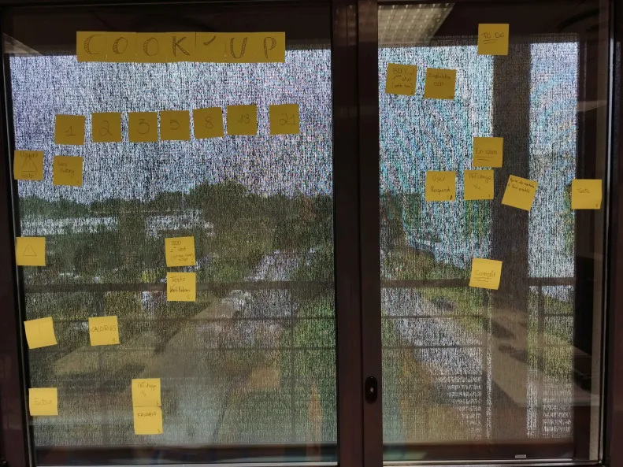

# Sprint 02

## Démo + Planification du sprint suivant

### Ce que nous avons fait durant ce sprint

Lors de ce sprint nous nous sommes penchés sur la réalisation des tests pour les fonctions quit ont été implémentées au sprint précédent

### Ce que nous allons faire durant le prochain sprint

User History
QUI : le logiciel est utilisable par une grande démographie, étudiant comme personne âgée.

QUOI : La possibilité pour l'utilisateur de voir la liste des ingrédients qui sont disponibles 
  
POURQUOI : pour qu'il puisse écrire plus facilement les ingrédients qu'ils possèdes dans le logiciel

## Rétrospective

### Sur quoi avons nous butté ?

Lors de ce sprint nous avons rencontré quelques problèmes dû à un manque de communication au niveau des push et de pulls engeandrant des conflits git

### PDCA

Pour résoudre nons problèmes nous allons essayer des communiquer un peu plus oralement en prévenant les autres des actions que nous allons effectuer

# Mémo

