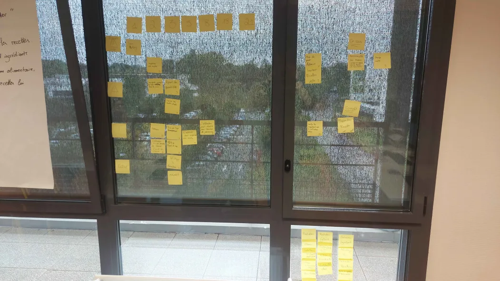

# Sprint 04

## Démo + Planification du sprint suivant

### Ce que nous avons fait durant ce sprint

Lors de ce sprint nous avons ajouté des fonctionnalitées tel que la possibilité de proposer une recette par l'utilisateur, l'insertion des ingredients, une meilleur affichage.

### Ce que nous allons faire durant le prochain sprint

User History
QUI : le logiciel est utilisable par une grande démographie, étudiant comme personne âgée.

QUOI : La possibilité pour l'utilisateur de proposer des recettes.
  
POURQUOI : pour qu'il y ait de nouvelle recettes dans la base donnée.

## Rétrospective

### Sur quoi avons nous butté ?

Lors de ce sprint nous avons rencontré quelques problèmes avec git, nous avons mal éstimé certaines tâches

### PDCA

Pour résoudre nons problèmes nous allons essayer des communiquer beaucoup plus oralement en prenant le temps pour prévenir les autres des actions que nous allons effectuer

# Mémo

