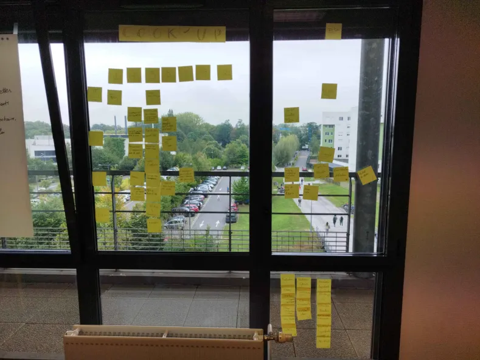

# Sprint 05

## Démo + Planification du sprint suivant

### Ce que nous avons fait durant ce sprint

Lors de ce sprint nous avons fait un mot de passe pour accéder au compte admin et nous avons avançé sur le front.

### Ce que nous allons faire durant le prochain sprint

User story
QUI : le logiciel est utilisable par une grande démographie, étudiant comme personne âgée.

QUOI : La possibilité pour l'utilisateur de voir la liste des ingrédients qui sont disponibles 
  
POURQUOI : pour qu'il puisse écrire plus facilement les ingrédients qu'ils possèdes dans le logiciel

## Rétrospective

### Sur quoi avons nous butté ?

Lors de ce sprint nous avons rencontré quelques problèmes de coordinnation entre le back-end et le front-end avec un décalage qui bloque certaine personnes dans leur avancemant.

### PDCA

Pour résoudre nons problèmes nous allons commencer le back-end plus tôt afin que le front-end avance de manière plus fluide.

# Mémo

