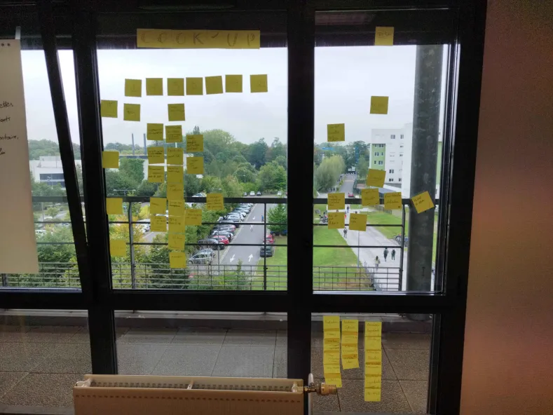

# Sprint 05

## Démo + Planification du sprint suivant

### Ce que nous avons fait durant ce sprint

Lors de ce sprint nous avons fait valider certaines révisions par les proffesseurs ainsi qu'améliorer l'expérience utilisateur

### Ce que nous allons faire durant le prochain sprint

User story
QUI : le logiciel est utilisable par une grande démographie, étudiant comme personne âgée.

QUOI : La possibilité de quitter l'application
contrôle de saisie et répétition pour le mot de passe admin
la possibilité pour l'utilisateur de revenir sur le menu principal

POURQUOI : pour améliorer l'expérience utilisateur

## Rétrospective

### Sur quoi avons nous butté ?

Lors de ce sprint nous avons rencontré quelques problèmes liés à l'arborescence de nos fichiers ce qui nous a crée beaucoup de conflit que nous avons dû gérer ce qui nous a fait perdre pas mal de temps

### PDCA

Faire plus attention à l'arborescence présente dans les sujets

# Mémo

 //Changer le radiateur
