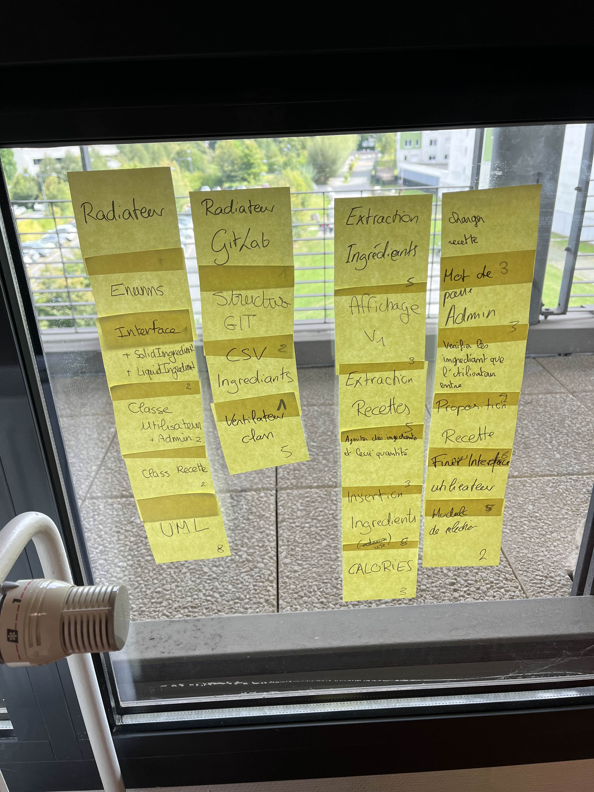

# Sprint 05

## Démo + Planification du sprint suivant

### Ce que nous avons fait durant ce sprint

Lors de ce sprint nous avons fait donner la possibilité pour l'utilisateur de quitter l'application,
un contrôle de saisie qui boucle lorsque l'on essaye de se connecter en admin si l'utilisateur s'est trompé et la possibilité pour l'utilisateur de revenir vers le menu principal

### Ce que nous allons faire durant le prochain sprint

User story
QUI : le logiciel est utilisable par une grande démographie, étudiant comme personne âgée.

QUOI : La possibilité pour l'utilisateur de voir les recettes qui lui sont disponibles avec les ingrédients qu'il possède
Plus de possibilité dans la navigation pour l'utilisateur

POURQUOI : pour qu'il puisse pouvoir cuisiner avec les ingrédients qui lui sont disponibles
pour qu'il puisse avoir accès à plus de fonctionnalités

## Rétrospective

### Sur quoi avons nous butté ?

Lors de ce sprint nous avons rencontré un problème lors de notre démo lié à un merge trop tardif de nos différentes versions ce qui nous a crée une boucle infini et nous a grandement ralenti dans notre travail

### PDCA

Pour résoudre nons problèmes nous allons commencer à tagguer la dernière version utilisable de notre application afin que la démo se déroule plus fluidement.

# Mémo

