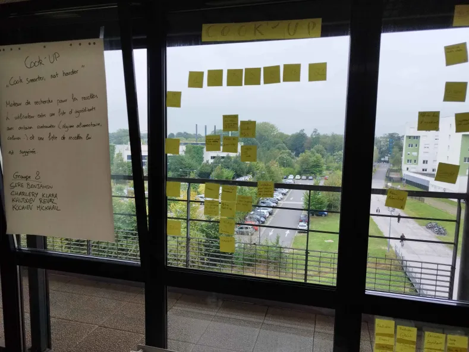

# Sprint 08

## Démo + Planification du sprint suivant

### Ce que nous avons fait durant ce sprint

Lors de ce sprint nous avons corrigé de nombreux erreurs du dernier sprint et permis au client de se déplacer dans tout le menu autant dans la partie utilisateur que la partie admin

### Ce que nous allons faire durant le prochain sprint

User story
QUI : le logiciel est utilisable par une grande démographie, étudiant comme personne âgée.

QUOI : La possibilité pour l'utilisateur de voir les recettes qui lui sont disponibles et la possibilitée pour l'admin de supprimer des recettes.

POURQUOI : pour qu'il puisse pouvoir cuisiner avec les ingrédients qui lui sont disponibles et pour pouvoir supprimer des recettes ajouté par erreurs.

## Rétrospective

### Sur quoi avons nous butté ?

Lors de ce sprint nous avons rencontré un problème à cause des erreurs du dernier sprint et sur l'implémentation d'un type générique.

### PDCA

Pour résoudre nons problèmes nous allons nous mettre à plusieurs sur des erreurs car ça a marché lors de ce sprint.

# Mémo

