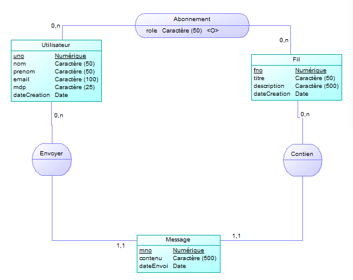

# **Rapport SQL de Projet – CampusTalk**

## **Sommaire**

1. [**Introduction**](#1-introduction)  
   - Présentation du projet **CampusTalk**  
   - Objectifs du rapport

2. [**Modélisation de la Base de Données**](#2-modélisation-de-la-base-de-données)  
   - Description des entités : **Utilisateur**, **Fil**, **Message**, **Abonnement**, **Notification**, **Like**  
   - Schéma du modèle de données  
   - Évolution du modèle de données : questions et réflexions sur la validité et l'optimisation

3. [**SQL pour la Création des Tables**](#sql-pour-la-création-des-tables)  
   - Scripts SQL pour la création des tables de la base de données

4. [**Requêtes SQL pour Tester la Base de Données**](#4-requêtes-sql-pour-tester-la-base-de-données)  
   - Fichier contenant les requêtes SQL pour tester l'intégrité de la base de données ([sql/script.sql](./sql/script.sql))

5. [**Conclusion**](#5-conclusion)  
   - Optimisations à apporter  
   - Réflexions sur la gestion des notifications et des rôles  
   - Erreurs commises et améliorations possibles  
   - Analyse de la gestion des données et des relations dans la base de données


## **1. Introduction**  

Ce rapport présente la conception et l’implémentation de la base de données SQL pour **CampusTalk**, une application de discussion en ligne. Il détaille la modélisation des données, la création des tables et les requêtes essentielles pour assurer l’intégrité et l’optimisation du système. L’objectif est d’expliquer les choix structurels et d’identifier les améliorations possibles en termes de performance et de gestion des relations entre les entités.


## **2. Modélisation de la Base de Données**

Lors de la modélisation de la base de données, nous avons initialement conçu un modèle comportant quatre tables : **Utilisateur**, **Abonnement**, **Fil** et **Message**, comme illustré ci-dessous :  


Cependant, comme vous pouvez le constater, la base de données comporte désormais six tables. Ces tables ont été créées et évoluées au fur et à mesure de l'avancement du projet. Cela soulève une question importante :  
**Mon modèle de données est-il toujours valide ? Y a-t-il des redondances ou des incohérences ?**

Il est possible que des optimisations et des corrections soient nécessaires pour améliorer la structure et la performance de la base de données.

### **2.1. Description des Entités**  
 
#### **Utilisateur**  
- **uno** (Identifiant unique) : Identifiant unique de chaque utilisateur (pseudo).
- **nom** : Nom de l'utilisateur.
- **prenom** : Prénom de l'utilisateur.
- **email** : Adresse e-mail unique de l'utilisateur.
- **mdp** : Mot de passe de l'utilisateur.
- **dateCreation** : Date de création de l'utilisateur (par défaut, la date et l'heure actuelles).

L'utilisateur peut créer des fils de discussion, s'abonner à des fils existants et envoyer des messages.

#### **Fil de Discussion**  
- **fno** (Identifiant unique) : Identifiant unique du fil de discussion.
- **titre** : Titre du fil de discussion.
- **description** : Description du fil de discussion.
- **dateCreation** : Date de création du fil de discussion (par défaut, la date et l'heure actuelles).

Le fil de discussion peut être suivi par plusieurs utilisateurs.

#### **Message**  
- **mno** (Identifiant unique) : Identifiant unique du message.
- **contenu** : Contenu du message envoyé.
- **imagePath** : Chemin vers une image, si le message contient une image (optionnel).
- **dateEnvoi** : Date et heure d'envoi du message (par défaut, la date et l'heure actuelles).
- **uno** (Utilisateur) : L'identifiant de l'utilisateur ayant envoyé le message.
- **fno** (Fil de discussion) : L'identifiant du fil de discussion auquel appartient le message.

#### **Abonnement**  
- **uno** (Utilisateur) : L'identifiant de l'utilisateur.
- **fno** (Fil de discussion) : L'identifiant du fil de discussion auquel l'utilisateur est abonné.
- **role** : Le rôle de l'utilisateur par rapport au fil de discussion (`ADMIN`, `MEMBRE`).

L'abonnement gère les abonnements des utilisateurs aux fils de discussion.

#### **Notification**  
- **nno** (Identifiant unique) : Identifiant unique de la notification.
- **uno** (Utilisateur) : L'identifiant de l'utilisateur auquel la notification est envoyée.
- **fno** (Fil de discussion) : L'identifiant du fil de discussion concerné par la notification.
- **type** : Type de notification (par exemple, "abonnement", "message").
- **etat** : L'état de la notification (par défaut, `EN_ATTENTE`, avec les options possibles `REFUSEE` ou `ACCEPTEE`).
- **dateEnvoi** : Date d'envoi de la notification (par défaut, la date et l'heure actuelles).

La notification gère les notifications envoyées aux utilisateurs concernant des événements dans les fils de discussion, avec un statut d'acceptation ou de refus.
Par exemple l'invitation dans un fil.

#### **Like**  
- **uno** (Utilisateur) : L'identifiant de l'utilisateur ayant aimé le message.
- **mno** (Message) : L'identifiant du message qui a été aimé.
- **dateLike** : Date de l'action de "like" (par défaut, la date et l'heure actuelles).

Le like enregistre les "j'aime" des utilisateurs sur les messages, permettant de suivre l'engagement et l'interaction.

### **SQL pour la création des tables**

```sql
CREATE TABLE IF NOT EXISTS Utilisateur (
    uno VARCHAR(50) PRIMARY KEY,  -- Pseudo unique de chaque utilisateur
    nom VARCHAR(50) NOT NULL,
    prenom VARCHAR(50) NOT NULL,
    email VARCHAR(100) NOT NULL,
    mdp VARCHAR(25) NOT NULL,
    dateCreation TIMESTAMP DEFAULT CURRENT_TIMESTAMP NOT NULL
);

CREATE TABLE IF NOT EXISTS Fil (
    fno SERIAL PRIMARY KEY,
    titre VARCHAR(50) NOT NULL,
    description VARCHAR(500),
    dateCreation TIMESTAMP DEFAULT CURRENT_TIMESTAMP NOT NULL
);

CREATE TABLE IF NOT EXISTS Abonnement (
    uno VARCHAR(50),
    fno INT,
    role VARCHAR(50),  -- Rôle de l'utilisateur par rapport au fil (USER, ADMIN, BANNI)
    PRIMARY KEY (uno, fno),
    FOREIGN KEY (uno) REFERENCES Utilisateur(uno) ON DELETE CASCADE,
    FOREIGN KEY (fno) REFERENCES Fil(fno) ON DELETE CASCADE
);

CREATE TABLE IF NOT EXISTS Message (
    mno SERIAL PRIMARY KEY,
    contenu VARCHAR(500) NOT NULL,
    imagePath VARCHAR(255),
    dateEnvoi TIMESTAMP DEFAULT CURRENT_TIMESTAMP NOT NULL,
    uno VARCHAR(50) NOT NULL,
    fno INT NOT NULL,
    FOREIGN KEY (uno) REFERENCES Utilisateur(uno) ON DELETE CASCADE,
    FOREIGN KEY (fno) REFERENCES Fil(fno) ON DELETE CASCADE
);

CREATE TABLE IF NOT EXISTS Notification (
    nno SERIAL PRIMARY KEY,          
    uno VARCHAR(50) NOT NULL,         
    fno INT NOT NULL,                 
    type VARCHAR(50) NOT NULL,
    etat VARCHAR(20) DEFAULT 'EN_ATTENTE' NOT NULL,  -- REFUSEE, ACCEPTEE
    dateEnvoi TIMESTAMP DEFAULT CURRENT_TIMESTAMP NOT NULL,
    FOREIGN KEY (uno) REFERENCES Utilisateur(uno) ON DELETE CASCADE,
    FOREIGN KEY (fno) REFERENCES Fil(fno) ON DELETE CASCADE
);

CREATE TABLE IF NOT EXISTS "Like" (  -- Le nom de la table est entre guillemets pour éviter la confusion avec la fonction LIKE de SQL
    uno VARCHAR(50) NOT NULL,
    mno INT NOT NULL,
    dateLike TIMESTAMP DEFAULT CURRENT_TIMESTAMP NOT NULL,
    PRIMARY KEY (uno, mno),
    FOREIGN KEY (uno) REFERENCES Utilisateur(uno) ON DELETE CASCADE,
    FOREIGN KEY (mno) REFERENCES Message(mno) ON DELETE CASCADE
);
```

## **4. Requêtes SQL pour Tester la Base de Données**

Vous pouvez retrouver toutes ces requêtes dans le fichier suivant : [sql/script.sql](../sql/script.sql).

## **5. Conclusion**

Comme mentionné précédemment, je pense qu'il y a des optimisations à apporter, notamment dans la gestion des notifications et des rôles. 

L'erreur que j'ai commise réside dans la mauvaise gestion des objectifs et des fonctionnalités à intégrer dans mon application, ce qui a entraîné une gestion des notifications qui ne correspond pas à la structure actuelle de la base de données. En effet, la gestion des notifications dans la base de données ne correspond pas aux rôles des notifications sur mon site.

En base de données, une notification peut être caractérisée par un type et un état. Ce qui me dérange, c'est le champ "type", car mon site ne prend en charge que les notifications de type **INVITATION** et **LIKE** . Cependant, une invitation doit être acceptée ou refusée, tandis qu'une notification de type **demande** indique qu'elle a été lue ou vue. Ces deux différences entraînent des logiques de gestion différentes entre une notification de type **INVITATION** et une notification de type **LIKE**. 

Après réflexion, je pense qu'il aurait été plus judicieux de créer une table **Invitation** pour simplifier la gestion des notifications, déjà suffisamment complexe en raison de ses trois états possibles : **EN_ATTENTE**, **REFUSEE**, **ACCEPTEE**.

D'un autre côté, j'ai essayé de gérer autant que possible les éléments dans la base de données, notamment pour les dates et les valeurs par défaut. Mon objectif était d'éviter les valeurs nulles et la redondance de données, même si cela entraîne parfois des requêtes assez complexes avec deux ou trois jointures. Mais je pense que c'est justement l'un des objectifs d'une base de données bien conçue.

Enfin, j'ai cherché à rendre le modèle aussi propre que possible. J'aurais pu m'en sortir encore mieux en définissant plus précisément les fonctionnalités dès le départ.


